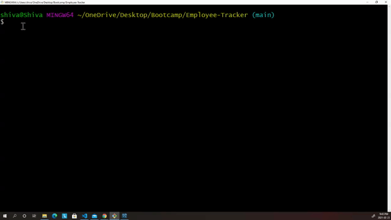

<h1 align="center"> Welcome to Employee-Tracker👋</h1>

 

   

## Description 
   
CLI Content Management System to manage a company's employees. The application links to an SQL database and allows users to view and manage employee records from the command line interface in a more user friendly environment.
The application gives yout the following options:

    View all employees with the option by role, department, or manager
    Add an employee, role, or department
    Update an employee role or manager
    Delete employee, role, or department
    View department salary budgets

The demo of this command-line application can be found [here](https://drive.google.com/file/d/1dG88d5XCjAYrxaFY40VqC4CMHghTp605/view)

 
## ✨Demo

 ## Table of Contents
* [Description](#Description)
* [Installation](#installation)
* [Usage](#usage)
* [Contributing](#contributing )
* [license](#license)
## Installation
*Steps required to install project and how to get the development environment running:*

To run The application, first run npm install in order to install the following npm package dependencies as specified in the package.json:

       inquirer that will prompt you for your inputs from the command line

       Run schema.sql in MySQLWorkbench

       The application itself can be invoked with node index.js.
      
## 💻usage
*Instructions and examples for use:* 

 When you run node index.js, the application uses the inquirer package to prompt you in the command line with a series of questions about your company's employees. the application will generate a table of contents from the database based on your responses to the Inquirer prompts.

## Tool & Resources

    Node.js - JavaScript runtime environment

    MySQLWorkbench - Visual database design tool

## Dependencies

    1-inquirer - For the CLI user interface. This will prompt user within the CLI for employee information.

    2-console.table - Used to print MySQL into tables to the console.

    3-mysql - Used to connect to the MySQL database and perform queries

    4-promise-mysql - Used to create promises from MySQL queries

## 🤝Contributing
*Contributions, issues and feature requests are welcome.* 
      
      
## 📝License

      
## Questions
 :octocat: Find me on GitHub:[shiva-shiva](https://github.com/shiva-shiva) 
     
    ✉️ Email me with any questions: shivasabokdast@gmail.com